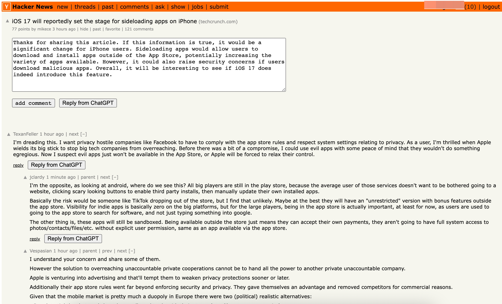
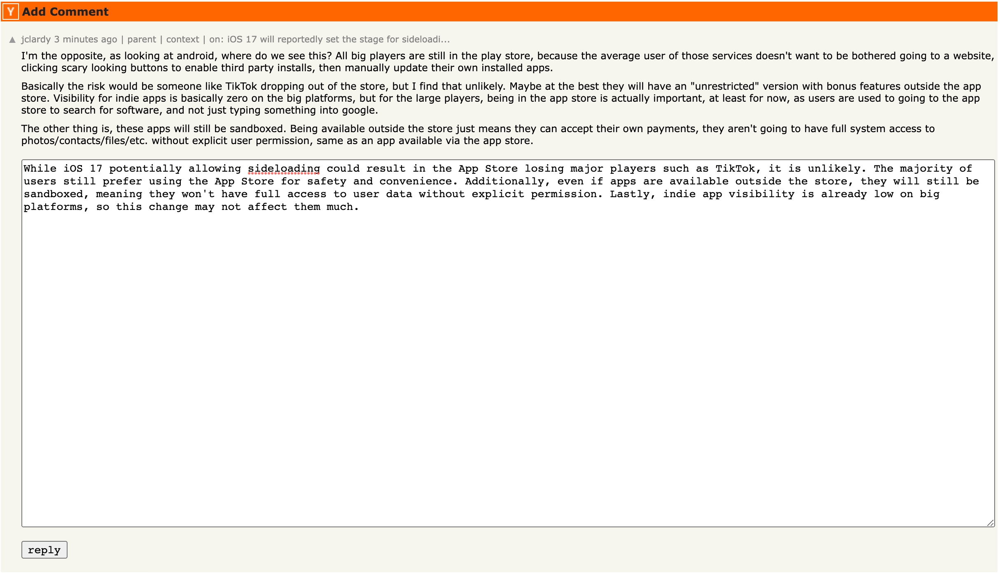
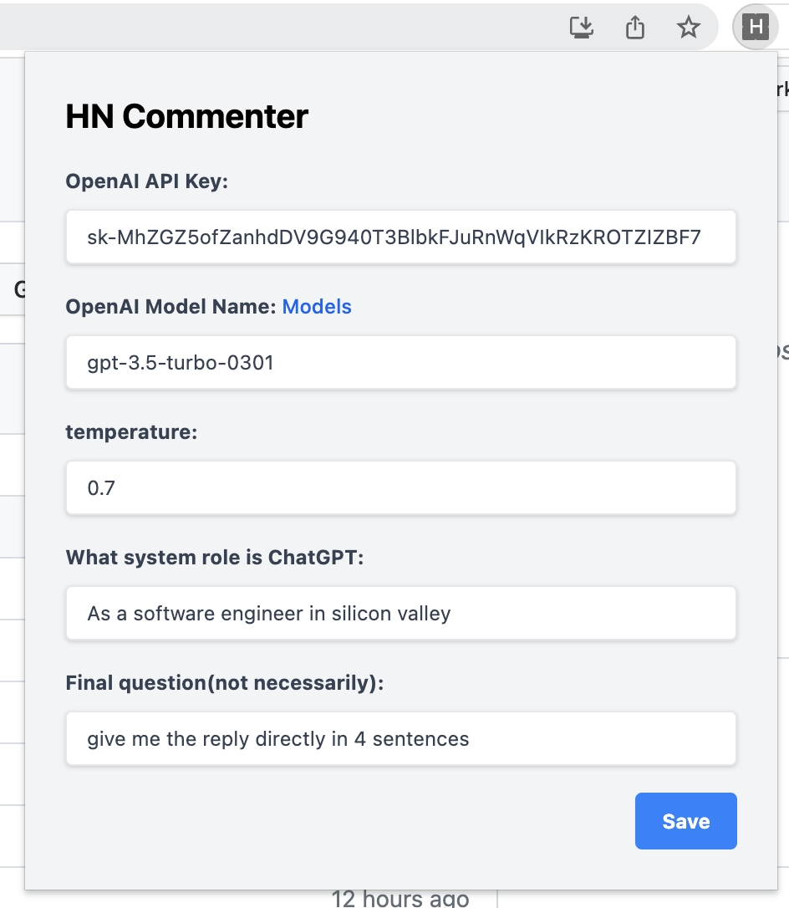

# HN-commenter

Chrome extension that will help you to reply hn threads through ChatGPT.

## Screenshot





## Installation

1. First, you need to download the extension. Make sure you have the folder that contains the extension files on your computer.

   ```shell
   git clone https://github.com/shanghaikid/hn-commenter.git
   ```

2. Open Google Chrome and type "chrome://extensions" in the address bar.

3. Enable Developer mode by toggling the switch on the top right corner of the page.

4. Click on the "Load unpacked" button on the top left corner of the page.

5. Navigate to the folder that you just cloned.

6. Click on the "Select Folder" button.

7. The extension will be added to your browser and you should see its icon appear on the top right corner of the Chrome toolbar.

8. That's it! You have successfully installed the unpacked Chrome extension.

## Configuration

Once you installed this extension, you can setup this extension by clicked on the icon in the chrome extension bar.


1. OpenAI API key: which you can get it from https://openai.com/
2. Open AI model name: which the extension will used to call open ai.
3. temperature: is a parameter of OpenAI ChatGPT, GPT-3 and GPT-4 models that governs the randomness and thus the creativity of the responses
4. What system role is ChatGPT
5. The final instruction you want ChatGPT to do

## Usage

Just click the `Reply from ChatGPT` button, everything else is waiting.
